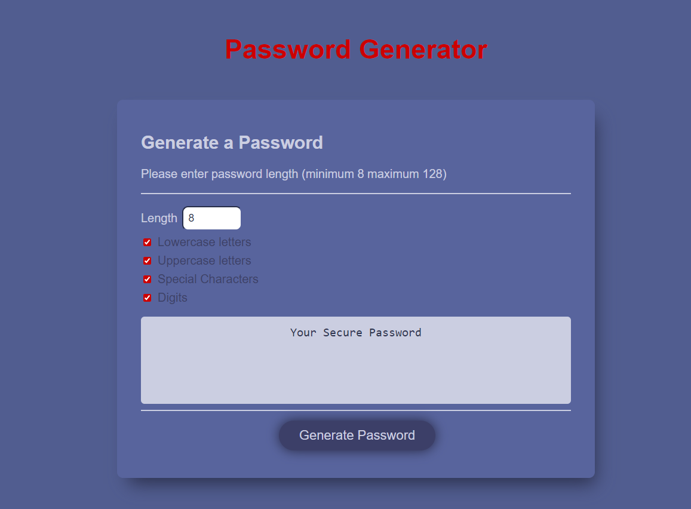

# user-password

## Description

This week my task was to generate a password for the user from 8-128 characters. Plus, the user had the right to choose (Uppercase, lowercase, digits and special characters)
To simplify the task a little, for this I used a checkbox.
The user has the right to choose the total number of characters and just click the checkbox on your preference ( uppercase lowercase digits and special character)
Basis of all here is length  input (only NUMBER) which we use for each checkbox user clicks. In JS adding if statements then we use while true/ math floor/math random. Also we use the if statement if the user doesn't click the checkbox return empty.
 It's a clear and fast way to generate passwords for users.
As always I need time to make my page look more attractive with CSS.I don't know about you but I love it when a user just wants to look at a page even if he doesn't need anything on this page and he just sticks to the design.
 

 ## Installation
 N/A

## Usage

## Credits 
N/A
## License
https://mary90272.github.io/user-password/
